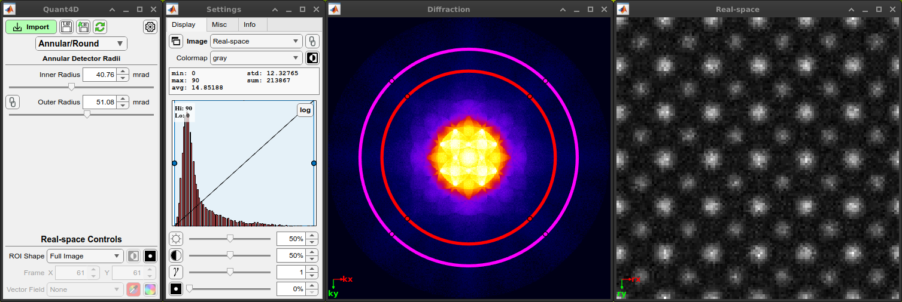

.. image:: https://zenodo.org/badge/DOI/10.5281/zenodo.15493504.svg
  :target: https://doi.org/10.5281/zenodo.15493504

.. _index:
Welcome to the Quant4D documentation
====================================

`Quant4D` is an open source graphical interface for quickly and intuitively 
opening, interacting with, and performing basic analysis of 4D-STEM data.

Documentation
=============

Quant4D documentation is `available here <https://quant4d.readthedocs.io/en/latest>`_.

.. _installation:

Installation
============

MATLAB Requirements
-------------------

`Quant4D` is tested and stable on MATLAB R2021a or later. If performing a fresh
installation of MATLAB, please ensure the following MATLAB Toolboxes are
selected during the installation process: 

#. Image Processing
#. Parallel Computing
#. Statistics and Machine Learning

If MATLAB is already installed, check whether or not the required Toolboxes are
installed by typing in ``ver`` to the MATLAB Command Window.

If some or all of the required Toolboxes are missing, they can be installed by
first running MATLAB with administrator rights. Then, from the **Home** tab,
under the **Environment** section, click the **Add-Ons** icon. From the Add-On
Explorer, you can search for and install the required toolboxes listed above.
More info can be found on the
`MathWorks website <https://mathworks.com/help/matlab/matlab_env/get-add-ons.html>`_.

Installing Quant4D App
----------------------
.. image:: ./docs/_static/app_install.png
    :scale: 50%
    :align: right
    
The simplest way to install `Quant4D` is via the application installer file
(`Quant4D.mlappinstall <https://github.com/bryandesser/Quant4D/blob/master/app_installer/Quant4D.mlappinstall>`_).
Download and open the file, which will open MATLAB and ask to install `Quant4D`
into **My Apps** (see below). Click `Install` and then open the app from the
**Apps** tab on the MATLAB Toolstrip. The app may be buried on the list - if so,
click the drop-down arrow on the far right of the toolstrip.

Running Quant4D code directly
-----------------------------

`Quant4D` can also be run directly from the source code, which gives access to
debugging and live user interaction with the underlying experimental data for
additional functionality. To do this, first download the
`source code <https://github.com/bryandesser/Quant4D/tree/master/source_code>`_.
Then open MATLAB, navigate to the downloaded source code directory, and add the
directory and subdirectories to the MATLAB path by right-clicking on the parent
directory and clicking `Add to Path > Selected Folders and Subfolders`.
Alternatively, you can type ``addpath(genpath('.'))``. Once the source code
directory is on the MATLAB path, open `Quant4D.mlapp` either by double-clicking
it from the MATLAB file explorer tab or typing ``open('Quant4D.mlapp')``, which
will open the MATLAB App Designer. In App Designer, simply press the **Run**
button in the **Designer** Tab under the **Run** section. This will start the
`Quant4D` app, whilst still allowing the user to debug, insert breakpoints, and
modify code as desired.

.. image:: ./docs/_static/add_to_path.png
    :width: 382
    :height: 260
    :align: center

.. _acknowledgement:

Acknowledgement
=======

.. image:: https://zenodo.org/badge/DOI/10.5281/zenodo.15493504.svg
  :target: https://doi.org/10.5281/zenodo.15493504
  
If you use the Quant4D software for your 4D-STEM related research, 
please cite the software using the Zenodo DOI.

`B. D. Esser (2025). Quant4D, Zenodo. https://doi.org/10.5281/zenodo.15493503
<https://doi.org/10.5281/zenodo.15493503>`_.

A peer-reviewed publication is still in progress, but will be updated here when
complete.

Please also watch the
`Quant4D repository <https://github.com/bryandesser/Quant4D>`_ on GitHub for
future updates.