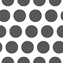
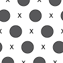
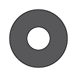
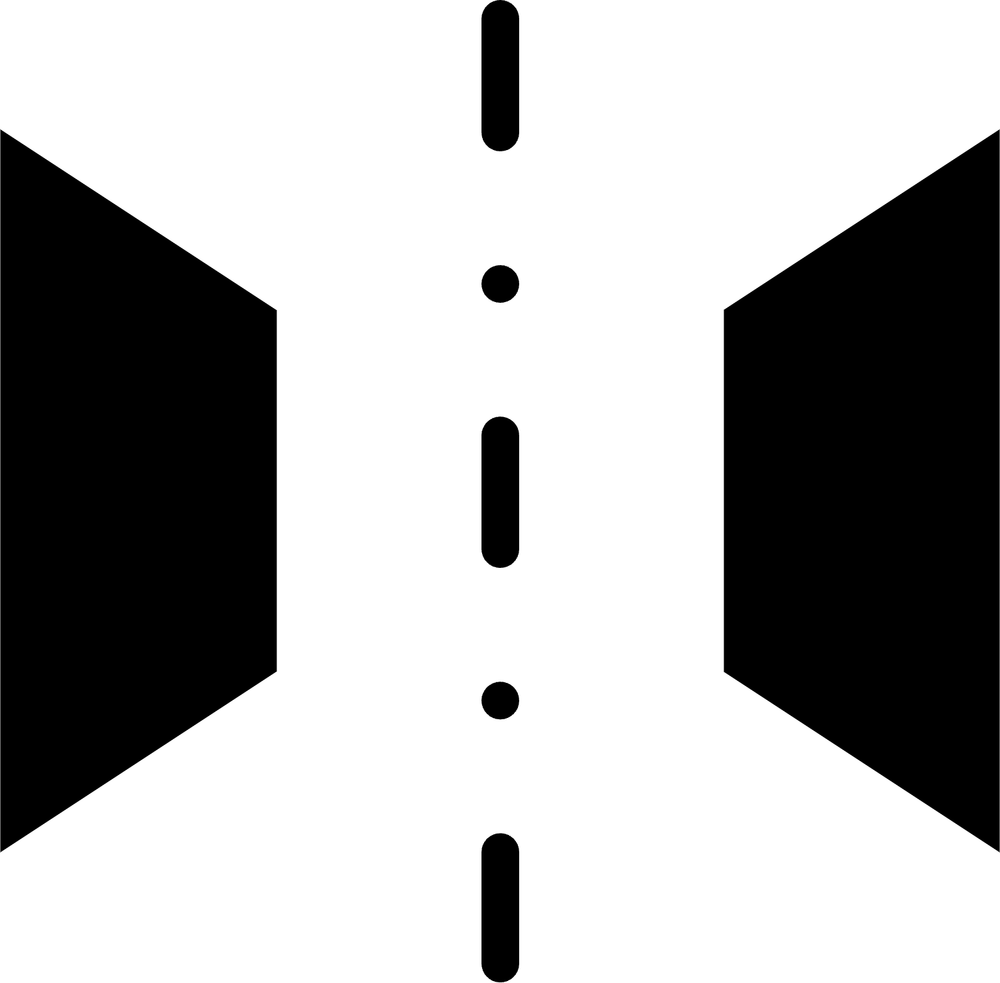
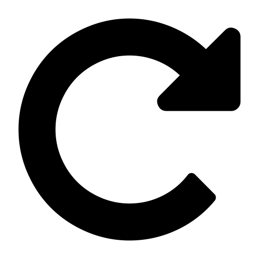
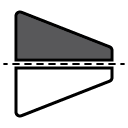
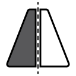

.. _custom_apertures:

.. |circle| image:: ../../src/icons/circle.png
    :height: 2ex
    :class: no-scaled-link

.. |wedge| image:: ../../src/icons/wedge.png
    :height: 2ex
    :class: no-scaled-link
.. |polygon| image:: ../../src/icons/polygon.png
    :height: 2ex
    :class: no-scaled-link
.. |openMask| image:: ../../src/icons/openMask.png
    :height: 2ex
    :class: no-scaled-link

.. |invertColors| image:: ../../src/icons/invertColors.png
    :height: 2ex
    :class: no-scaled-link
.. |colorPicker| image:: ../../src/icons/colorPicker.png
    :height: 2ex
    :class: no-scaled-link
.. |left_rotate| image:: ../../src/icons/left_rotate.png
    :height: 2ex
    :class: no-scaled-link

.. |transpose| image:: ../../src/icons/transpose.png
    :height: 2ex
    :class: no-scaled-link

================
Custom Detectors
================

Quant4D offers a number of more flexible detector mask options that can also be
interfered in several different ways, as described in further detail below. 

Detector Types
**************
There currently six pre-defined detector mask options, as listed below, with
the added ability to import a pre-calculated diffraction mask (with caveats).
At present, all pre-defined masks are centered on the transmitted beam.

* |circle| - Circular aperture (can be mirrored).
* |grid| - Grid of circular apertures
* |grid_no_tb| - Grid of circular apertures, excluding the transmitted beam,
  as well as every 2nd lattice location. This is especially useful when
  interrogating superlattice reflections, whilst ignoring Bragg reflections
  from the matrix. 
* |bandpass| - Bandpass mask.
* |wedge| - Wedge mask extending from the transmitted beam to the edges of the
  diffraction pattern. Default is mirrored across the transmitted beam;
  however, this can be turned off to only capture scattering on one side of
  diffraction space.
* |polygon| - User-drawn polygon shaped diffraction mask.
* |openMask| - 

*Tip:* to use the pre-defined detector masks centered on a different region of
diffraction space, return to **Alignment** mode and shift the position of the
transmitted beam annotation to be centered on the intended region of interest.
Now all custom detector masks will be centered on the newly updated
"transmitted beam" center. 

Detector mask interactions
**************************
The user can add as many instances of a detector type as they wish. Because of
this, the interaction between masks must be defined, both at the inter- and
intra-mask level.

Inter-mask
========== 
This controls the interaction between all enabled detector masks.
* **Color Mix**: Images generated from each detector mask are added together
  with their automatically assigned color, which can also be changed by the
  user. (Default)
* **Union**: Logical `or` operation across all enabled detector masks.
  Resultant mask is binary 0 or 1. 
* **Intersection**: Logical `and` operation across all enabled detector masks.
  Resultant mask is binary 0 or 1.
* **Additive**: Similar to Color Mix; however, detector masks are added before
  image generation, thus individual component images are less obvious in the
  final resultant image. Additive overlap between detector masks can result in
  significant weighting in diffraction space.
* **Current only**: Only generate an image using the currently selected
  detector mask, irrespective of other enabled detector masks. 

Intra-mask
==========
Similar to inter-mask operations, some detector masks can result in overlapping
components, requiring well-defined behavior. 
* **Union**: Logical `or` operation for all components within the selected
  mask. Resultant mask is binary 0 or 1. (Default)
* **Intersection**: Logical `and` operation for all components within the
  selected mask. Resultant mask is binary 0 or 1.
* **Additive**: Any overlapping components within the selected mask will be
  added, resulting in increased weighting in those regions of diffraction
  space.

Mask-specific options
*********************
Several mask transformation options exist depending on the specifics of the
selected mask geometry. Not all options are available at all times. 

* |mirrored| - mirror the mask across the transmitted beam.
* |invertColors| - invert the mask ([True, False] -> [False, True]).
* |colorPicker| - change mask display color.
* |left_rotate|, |right_rotate| - rotate mask by angle in the dropdown.
* |mirrorHorz| - mirror the mask across the horizontal plane ([x, y] -> [x, -y]).
* |mirrorVert| - mirror the mask across the vertical plane ([x, y] -> [-x, y]).
* |transpose| - transpose the mask ([x, y] -> [y, x])

Mask maths
**************
Watch this space. 