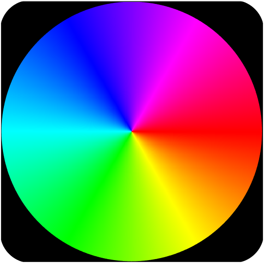

.. _dpc_com:

DPC/CoM
-------
Quant4D can generate Differential Phase Contrast (DPC) and Center of Mass (CoM)
images from the 4D-STEM dataset. In CoM mode, the center of mass is calculated 
from within the circular or round mask on the diffraction pattern. In DPC mode,
the circular/annular mask is subdivided into a user-defined number of sectors
both radially and azimuthally (default = 4 quadrants).

Scan rotation estimation
************************
It is critical to estimate the rotation angle between the scan direction in
real space and the diffraction pattern on the detector. The user can explicitly
set this angle in the main UI window, or it can be estimated automatically by
minimizing the curl as a function of the rotation angle. When the user first
enters either DPC or CoM mode, the **Scanning Direction** panel on the main UI
window will be highlighted in orange, indicating that the angle has not yet
been set. The user can enter or estimate the angle by first clicking the |lock|
icon to enable the inputs. If the user clicks the **Auto** button, the curl
minimization routine will run, using the estimated rotation angle and
automatically locking the **Scanning Direction** panel to avoid accidental
changes. In addition to the rotation angle, the handedness of the scan
direction can be swapped by enabling or disabling the |swap_y| icon, which
inverts the y-axis scan direction.

.. |lock| image:: ../../src/icons/lock.png
    :height: 2ex

.. |lock| image:: ../../src/icons/axis-y.png
    :height: 2ex

Images
******
Many images are calculated in DPC/CoM modes; however, most are not immediately
made visible to the user to avoid opening too many windows at once. The user
can show any/all of the following images by clicking the corresponding icon in
the **Show Image Windows** panel of  **Windows** tab in the **Settings** UI.
When the user is enters DPC or CoM mode, this tab is automatically activated.
The name of the images will automatically update to reflect the current mode
(i.e. CoMx or DPCx, etc.).

.. |colorpicker| image:: ../../src/icons/colorPicker.png
    :height: 2ex

* **Diffraction** - Main diffraction space image.
* |mask| **Diff. Mask** - Diffraction space mask used to generate images.
* **BF/DF** - Main real space image.
* |mask| **BF/DF Mask** - Real space mask (i.e. if an ROI is used)
* **CoM X**, **CoM Y** - CoM/DPC image in the x- and y-direction, respectively.
* **|CoM|** - CoM/DPC magnitude image.
* **CoM φ** - CoM/DPC phase image.
* |colorwheel| **φ** - Color wheel legend for phase images.
* **|CoM| φ** - CoM/DPC phase image with opacity based on the magnitude image
* **dCoM** - Differential CoM/DPC image.
* **iCoM** - Integrated CoM/DPC image. 

Vector overlays
***************
DPC and CoM imaging generates a vector field, which can be selectively overlaid
on any/all real space images. The user should first select the desired image by
either clicking the relevant button above, clicking within the image window
(i.e. *not* the title bar), or selecting the image from the **Image** dropdown
on the Display tab in the **Settings** UI. After the desired image is selected,
the user can click the **Vector Sampling** dropdown in the **Windows** tab of
the **Settings** UI. Vectors can be displayed at each pixel (1:1), or
subsampled by a factor of 2, 4, 8, or 16. This is especially helpful when the
vector field is highly oversampled compared to its rate of change.
Additionally, the user can change the color of the vector overlay independently
on each image using the |colorpicker| icon next to the vector sampling dropdown.

iDPC/iCoM
*********

dDPC/dCoM
*********

Filtering
*********
