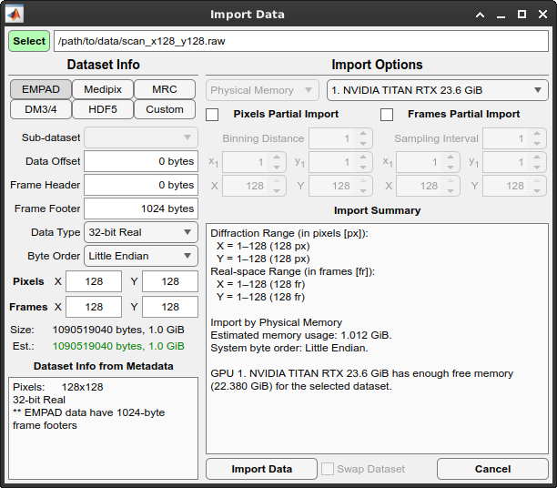
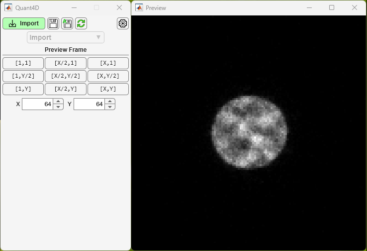
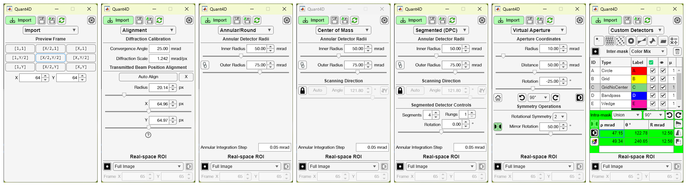
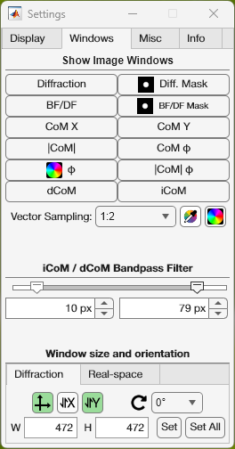
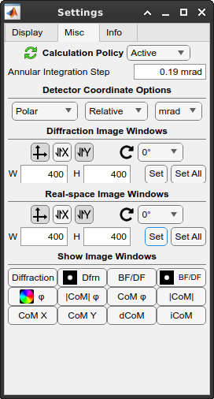
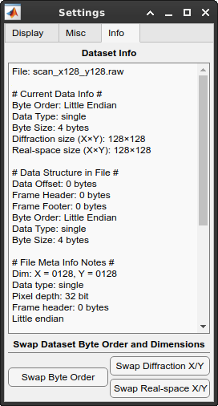
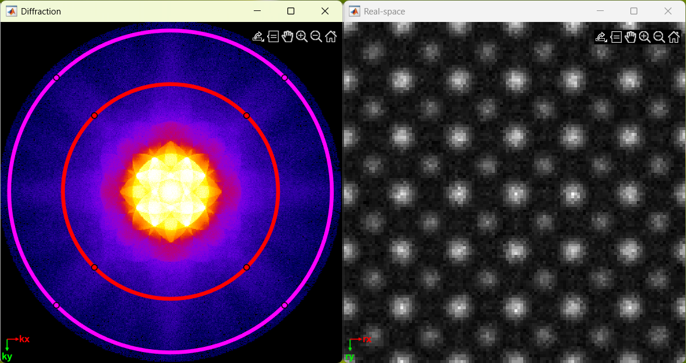
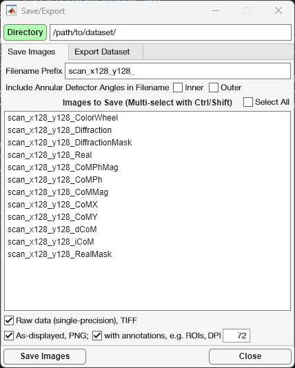
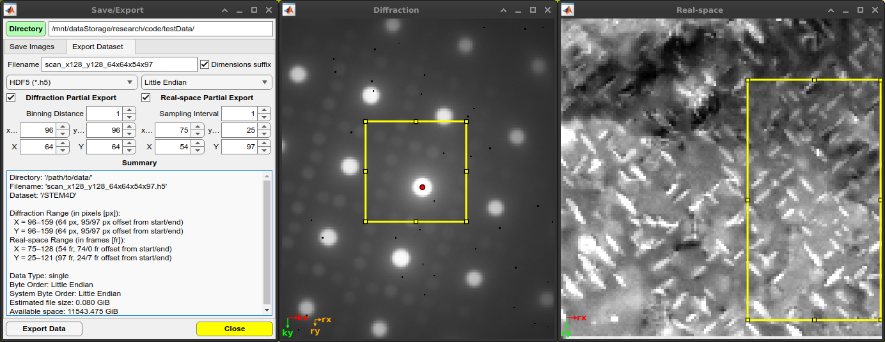

.. _graphical_user_interface:

Graphical user interface
========================
The graphical user interface (GUI) allows for intuitive interactions with
4D-STEM data. The GUI consists of two main windows and several other windows as
needed, as described below. 

Import Window
*************

The import window allows the user to import several common file formats (EMPAD,
Gatan, Medipix, MRC, HDF5) as well as any file format for which the user knows
the file structure.

* ``.raw`` files are assumed to be in the EMPAD file format with 128x128
  detector frames separated by a 1024 byte footer.
* ``.dm3/.dm4``, ``.hdf5``, and ``.hspy`` files are scanned allowing the user to
  select the correct dataset.
* ``.mib`` file metadata are scanned for the relevant parameters. 

Parameters
^^^^^^^^^^
* **Sub-dataset**: Choice of dataset in hierarchical datasets such as ``.hdf5``, 
  ``.hspy``, and ``.dm3/.dm4`` files.
* **Data offset**: Offset to the start of the 4D-STEM dataset in bytes.
* **Data header**: Header data size in bytes repeated before *each* contiguous
  chunk of data. 
* **Data footer**: Footer data size in bytes repeated after *each* contiguous
  chunk of data.
* **Data type**: Data type of the 4D-STEM dataset (8-, 16-, 32-, or 64-bit;
  signed integer, unsigned integer, or floating point)
* **Byte order**: Big or little endian ordering.
* **Axis order**: Order of the data axes as saved on disk. k\ :sub:`x` and
  k\ :sub:`y` represent detector axes (i.e. camera pixels); whereas,
  r\ :sub:`x` and r\ :sub:`y` represent the scan axes (i.e. real space probe
  positions). Default is (k\ :sub:`x`, k\ :sub:`y`, r\ :sub:`x`, r\ :sub:`y`)
  where detector images (k\ :sub:`x`, k\ :sub:`y`) are contiguous in memory.
* **Pixels (x,y)**: Number of detector pixels in each diffraction pattern. 
* **Frames (x,y)**: Number of probe positions.

File information
^^^^^^^^^^^^^^^^
* **Size**: Actual file size in GiB.
* **Estimated size**: Estimated dataset size in GiB based on the above
  parameters. If the two agree, the text will be shown in green; if not, it will
  show in red. 
* **Dataset Info from Metadata**: Information automatically detected from the 
  file metadata.

Import Options
^^^^^^^^^^^^^^
* **Memory**: Physical Memory reads the dataset into RAM (assuming there is
  sufficient memory available); Virtual Memory generates a
  `memmapfile <https://www.mathworks.com/help/matlab/ref/memmapfile.html>`_ for
  lazy loading. Virtual memory option is only available for contiguous datasets
  (i.e. no frame headers or footers), and is not particularly efficient on
  Windows systems.
* **GPU**: Selected CUDA-capable GPU (if available with sufficient memory).
* **Diffraction Partial Import**: Bin and/or crop each diffraction pattern.
* **Real-space Partial Import**: Subsample and/or crop the 4D-STEM dataset probe
  positions.
* **Import Summary**: Summarized import options. 

Preview Window
**************

    
Upon file selection, but before clicking **Import Data** in the **Import
Window**, the user can view individual frames from the dataset to ensure that
the file parameters are correct. If parameters like header, footer, offset, or
data type are incorrect, frames will display incorrectly especially further into
the dataset. Preset buttons are available for the first, middle, and final probe
positions in x and y, and the user can enter any given probe position as desired.
Image statistics automatically update and the user is given access to image
display controls (brightness/contrast/gamma).

Main Window
***********

The main window of the GUI has several different pages with mode-specific
controls. The pages are as follows:
 
* **Import Preview**: for previewing individual diffraction frames before
  importing the entire dataset.
* **Alignment**: fit and calibrate transmitted beam centering and radius, 
  including automatic alignment procedure. 
* **Annular/Round**: control simple annulus mask for BF/DF imaging.  
* **Segmented (DPC)**: generate a segmented annular/round detector and compute
  DPC-related images.
* **Center of Mass**: compute CoM-related images from an annular/round detector 
  mask. 
* **Virtual Aperture**: control a round virtual aperture with rotational and/or
  mirror symmetry operations. 
* **Custom Detectors**: generate any number of additional detector masks or
  import your own from file. 

Settings Window
***************
Display Tab
^^^^^^^^^^^
.. image:: ../_static/settings_display_tab.png
    :align: right
    :scale: 50%

* **Image**: Currently selected image window. Dropdown allows selection of any 
  currently available image window. 
* **Show image**: Bring currently selected image window to the front (or show if
  currently closed).
* **Image lock**: Lock current image window selection; helps keeps focus on 
  image statistics for the selected image window. 
* **Colormap**: Change the displayed colormap for the selected image window.
* **Invert**: Invert selected colormap.
* **Image stats**: Statistics for the currently selected image window.
* **Histogram**: Display histogram for currently selected image window. Allows 
  for interactive brightness/contrast and log/linear view.
* **Brightness/Contrast/Gamma**: Controlled via sliderbar or numerical input;
  reset via the icon at the left. 
* **Mask**: Modify mask opacity used on currently selected image window (i.e.
  diffraction pattern mask or real-space ROI). Display mask via icon at the left.

Windows Tab
^^^^^^^^^^^

* **Show image windows**: Show image window or bring to front (i.e. if closed or 
  hidden).
* **Vector sampling**: Add vector arrows to real-space images in DPC or CoM
  modes. Modify vector density/sampling and color. Show vector colorwheel.
* **Window size and orientation**: Set image window size in real or diffraction
  space; define x,y orientation (i.e. origin location); rotate image; show/hide
  axes on image.

Misc Tab
^^^^^^^^

* **Calculation Policy**: Active automatically updates all image displays as the
  user interacts with the GUI; Reduced updates all image displays after the user
  is finished interacting with the GUI; Passive only updates image displays when
  the user clicks the Refresh button on the Main Window.
* **Detector coordinate options**: Polar or cartesian coordinates; locations
  displayed in absolute or relative to transmitted beam center; pixel or angular
  units.
* **Swap byte order**: Swap big endian <-> little endian in case incorrectly
  selected on import. Done in memory to avoid having to reimport the data.
* **Swap Diffraction/Real-space X/Y**: Swap x,y axes for diffraction and/or
  real-space in case incorrectly selected on import. This is most useful for
  non-square datasets and CoM/DPC. Done in memory to avoid having to reimport
  the data.

Info and Variables Tabs
^^^^^^^^^^^^^^^^^^^^^^^

* **Dataset info**: All information and parameters used for the currently loaded 
  dataset. 
* **Show all variables**: Display all important variables, constants, and UI
  elements on **Variables Tab**. 
* **Variables Tab**: Variables tree view allowing the user to view the value of
  and relative path to all of the important and relevant variables. Top level
  tree nodes are first level children of the ``app``. For example, the
  ``ColorWheel`` widow listed under the ``figures`` node can be found at
  ``app.figures.ColorWheel``. All variables are displayed read-only at this
  point. 

Image Windows
*************

Individual windows are created for all images, including diffraction space,
real-space, ROI masks, and vector colorwheel. All image windows that view the
same space respond simultaneously to any changes in zoom and pan to unify their
field of view. All image windows come with a toolbar |image_toolbar| in the
upper righthand corner that allows the user to export (save, copy, or copy as
vector graphic), query pixel intensities, pan, zoom in/out, and reset the field
of view.

Save/Export Window
******************
The **Save/Export** window allows users to save images or export a cropped
and/or binned subset of the original 4D-STEM dataset.

Save Images Tab
^^^^^^^^^^^^^^^

The **Save Images Tab** displays all images available for saving for the current
imaging mode. The user can select a filename prefix that will be prepended to
all images selected for saving. Additionally, annular collection angles can be
added to the filename, if desired. Multiple images can be selected by holding
**ctrl** whilst clicking, while holding **shift** will select a continuous range
of images for saving. 

* **Raw data**: data will be saved in the same intensity units and pixel density 
  as the original dataset in single precision TIFF file format.
* **As-displayed**: data will be saved as-displayed on the screen in PNG file
  format
* **with annotations**: PNG files will include all visible image annotations
  (i.e. detectors, ROIs, axes, etc.)
* **DPI**: user-defined dots per inch resolution of the PNG file (default 72 
  DPI).

Export Dataset Tab
^^^^^^^^^^^^^^^^^^

The **Export Dataset Tab** allows the users to export the dataset as HDF5
(``.h5``) or raw binary (``.raw``) format with options for selecting smaller ROIs in
the diffraction and/or real-space dimensions. The output file dimensions can
optionally be appended to the filename for convenience. 

* **Diffraction Partial Export**: diffraction space can be binned to reduce file 
  size; an ROI can be selected by changing the starting location
  (x\ :sub:`1`\, y\ :sub:`1`\) and the total number of pixels (X, Y).
* **Real-space Partial Export**: real-space can be subsampled to reduce file 
  size; an ROI can be selected by changing the starting location
  (x\ :sub:`1`\, y\ :sub:`1`\) and the total number of pixels (X, Y).