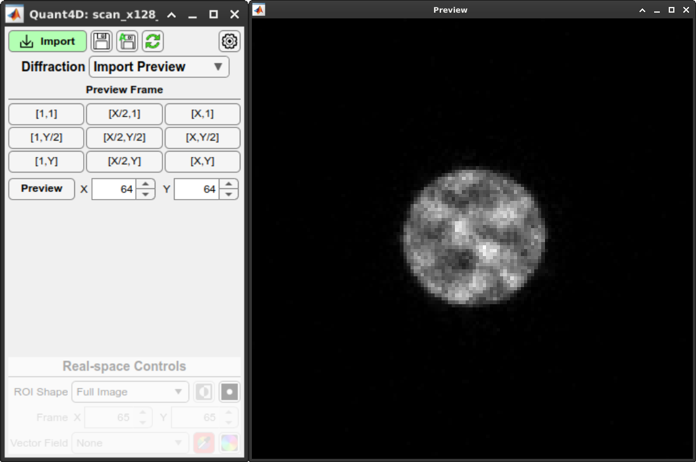
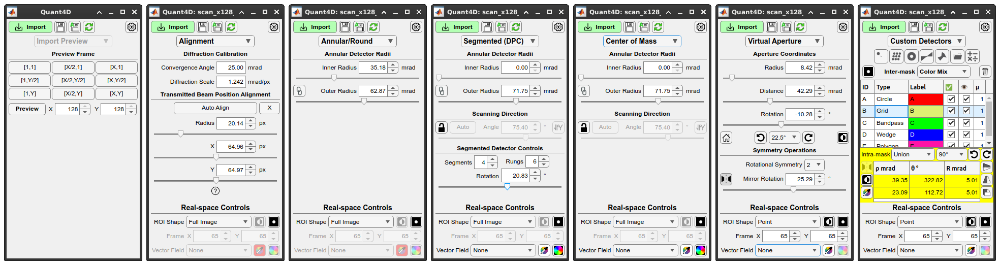
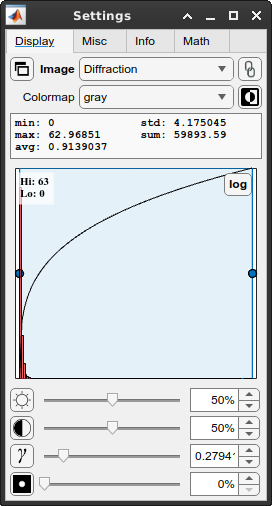

.. _graphical_user_interface:

Graphical user interface
========================
The graphical user interface (GUI) allows for intuitive interactions with the 4D-STEM data. The GUI consists of two main windows and several other windows as needed, as described below. 

Import Window
*************

The import window allows the user to import several common file formats (EMPAD, Gatan, Medipix, MRC, HDF5) as well as any file format for which the user knows the file structure.

* ``.raw`` files are assumed to be in the EMPAD file format with 128x128 detector frames separated by a 1024 byte footer.
* ``.dm3/.dm4`` and ``.hdf5`` files are scanned allowing the user to select the correct dataset.
* ``.mib`` file metadata are scanned for the relavent parameters. 

Parameters
^^^^^^^^^^
* **Sub-dataset**: Coice of dataset in hierarchical datasets such as ``.hdf5`` and ``.dm3/.dm4`` files.
* **Data offset**: Offset to the start of the 4D-STEM dataset in bytes.
* **Frame header**: Header data size in bytes repeated before *each* image frame. 
* **Frame footer**: Footer data size in bytes repeated after *each* image frame.
* **Data type**: Data type of the 4D-STEM dataset (8-, 16-, 32-, or 64-bit; signed integer, unsigned integer, or floating point)
* **Byte order**: Big or little endian ordering.
* **Pixels (x,y)**: Number of detector pixels in each frame. 
* **Frames (x,y)**: Number of probe positions.

File information
^^^^^^^^^^^^^^^^
* **Size**: Actual file size in GiB.
* **Estimated size**: Estimated dataset size in GiB based on the above parameters. If the two agree, the text will be shown in green; if not, it will show in red. 
* **Dataset Info from Metadata**: Information automatically detected from the file metadata.

Import Options
^^^^^^^^^^^^^^
* **Memory**: Physical Memory reads the dataset into RAM (assuming there is sufficient memory available); Virtual Memory generates a `memmapfile <https://www.mathworks.com/help/matlab/ref/memmapfile.html>`_ for lazy loading. Virtual memory option is only available for contiguous datasets (i.e. no frame headers or footers), and is not particularly efficient on Windows systems.  
* **GPU**: Selected GPU device (if available with sufficient memory).
* **Pixels Partial Import**: Bin and/or crop each frame.
* **Frames Partial Import**: Subsample and/or crop the 4D-STEM dataset probe positions. 
* **Import Summary**: Summarized import options. 

Preview Window
**************

    
Upon file selection, but before clicking **Import Data** in the **Import Window**, the user can view individual frames from the dataset to ensure that the file parameters are correct. If parametrs like header, footer, offset, or data type are incorrect, frames will display incorrectly especially further into the dataset. Preset buttons are available for the first, middle, and final probe positions in x and y, and the user can enter any given probe position as desired. Image statistics automatically update and the user is given access to image display controls (brightness/contrast/gamma).

Main Window
***********

The main window of the GUI has several different pages with mode-specific controls. The pages are as follows:
 
 * **Import Preview**: for previewing individual diffraction frames before importing the entire dataset.
 * **Alignment**: fit and calibrate transmitted beam centering and radius, including automatic alignment procedure. 
 * **Annular/Round**: control simple annulus mask for BF/DF imaging.  
 * **Segmented (DPC)**: generate a segmented annular/round detector and compute DPC-related images.
 * **Center of Mass**: compute CoM-related images from an annular/round detector mask. 
 * **Virtual Aperture**: control a round virtual aperture with rotational and/or mirror symmetry operations. 
 * **Custom Detectors**: generate any number of additional detector masks or import your own from file. 

Settings Window
***************
Display Tab
^^^^^^^^^^^

* **Image**: Currently selected image window. Dropdown allows selection of any currently available image window. 
* **Show image**: Bring currently selected image window to the front (or show if currently closed).
* **Image lock**: Lock current image window selection; helps keeps focus on image statistics for the selected image window. 
* **Colormap**: Change the displayed colormap for the selected image window.
* **Invert**: Invert selected colormap.
* **Image stats**: Statistics for the currently selected image window.
* **Histogram**: Display histogram for currently selected image window. Allows for interactive brightness/contrast and log/linear view.
* **Brightness/Contrast/Gamma**: Controlled via sliderbar or numerical input; reset via the icon at the left. 
* **Mask**: Modify mask opacity used on currently selected image window (i.e. diffraction pattern mask or real-space ROI). Display mask via icon at the left.

Misc Tab
^^^^^^^^

* **Calculation Policy**: Active automatically updates all image displays as the user iteracts with the GUI; Reduced updates all image displays after the user is finished interacting with the GUI; Passive only updates image displays when the user clicks the Refresh button on the Main Window.
* **Annular integration step**: User-defined step size for pre-computed annular images. Smaller steps give finer control of annular detectors at the expense of larger memory usage.
* **Detector coordinate options**: Polar or cartesian coordinates; locations displayed in absolute or relative to transmitted beam center; pixel or angular units.   
* **Diffraction/Real-space image windows**: set image window size; define x,y orientation (i.e. origin location); rotate image; show/hide axes on image.
* **Show image windows**: Show image window or bring to front (i.e. if closed or hidden).

Info Tab
^^^^^^^^

* **Dataset info**: All information and parameters used for the currently loaded dataset. 
* **Swap byte order**: Swap big endian <-> little endian in case incorrectly selected on import. Done in memory to avoid having to reimport the data.
* **Swap Diffraction/Real-space X/Y**: Swap x,y axes for diffraction and/or real-space in case incorrecrtly selected on import. This is most useful for non-square datasets and CoM/DPC. Done in memory to avoid having to reimport the data.

.. rst-class:: page-break

Image Windows
*************
test test test

Export Window
*************
test test test