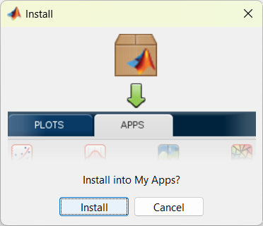

.. _installation:

Installation
============

.. contents:: Table of Contents
    :depth: 4

MATLAB Requirements
-------------------

`Quant4D` is tested and stable on MATLAB R2021a or later. If performing a fresh installation of MATLAB, please ensure the following MATLAB Toolboxes are selected during the installation process: 

#. Image Processing
#. Parallel Computing
#. Statistics and Machine Learning

If MATLAB is already installed, check whether or not the required Toolboxes are installed by typing in ``ver`` to the MATLAB Command Window.

If some or all of the required Toolboxes are missing, they can be installed by first running MATLAB with administrator rights. Then, from the **Home** tab, under the **Environment** section, click the **Add-Ons** icon. From the Add-On Explorer, you can search for and install the required toolboxes listed above. More info can be found on the `MathWorks website <https://mathworks.com/help/matlab/matlab_env/get-add-ons.html>`_.

Installing Quant4D App
----------------------

The simplest way to install `Quant4D` is via the installer file (`Quant4D.mlappinstall <https://github.com/bryandesser/Quant4D/blob/f2763094d9dcb171a399657edfd25c3209d20d6a/Quant4D.mlappinstall>`_). Download and open the file, which will open MATLAB and ask to install `Quant4D` into **My Apps** (see below). Click `Install` and then open the app from the **Apps** tab on the MATLAB Toolstrip. The app may be burried on the list - if so, click the drop-down arrow on the far right of the toolstrip.

Running Quant4D code directly
-----------------------------

`Quant4D` can also be run directly from the code, which gives access to debugging and live user interaction with the underlying experimental data for additional functionality. To do this, download the 